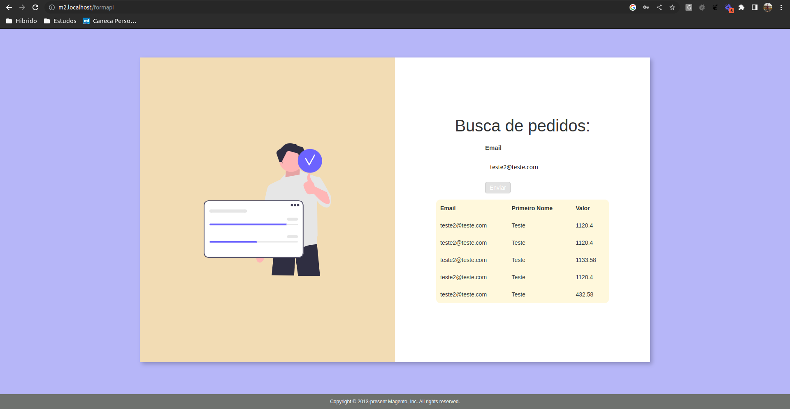

# Magento 2.4.x Module for create a CMS page for consulting orders by email

## Funcionalidade
- Criação de página CMS.
- Criação de formulário dentro da página CMS, com campo de busca por email.
- Consulta de pedidos via endpoint magento.
- Retorno de pedidos por meio de filtragem por email.
- Requisição ajax, retornando os pedidos sem necessidade de loading da página.
- Tabela com scroll dependendo da quantidade de pedidos.
- Layout do formulário e tabela responsivo.
- A implementação foi realizada acima do tema Luma padrão magento, então caso queira implementar em tema personalizado o mesmo pode ocasionar em quebras, sendo necessário adaptação.

### Instalação

- Descompactar o arquivo zip ou fazer o git clone de forma que fique em `app/code/Wayne/ShowOrders/...`
- Habilite o módulo executando `bin/magento module:enable Wayne_ShowOrders`
- Para aplicar a imagem no formulário copie a pasta `img` em `view/frontend/img` e cole em `pub/media`
- Aplique atualizações de banco de dados executando `bin/magento setup:upgrade`
- Limpe os caches executando `sudo rm -rf generated/code/* pub/static/frontend/* var/cache/* var/page_cache/* var/view_preprocessed/* && bin/magento cache:flush`

### Instrução

- Para acessar o formulário acesse a URL `<my-localhost-domain>/formapi`

### Resultado Esperado

